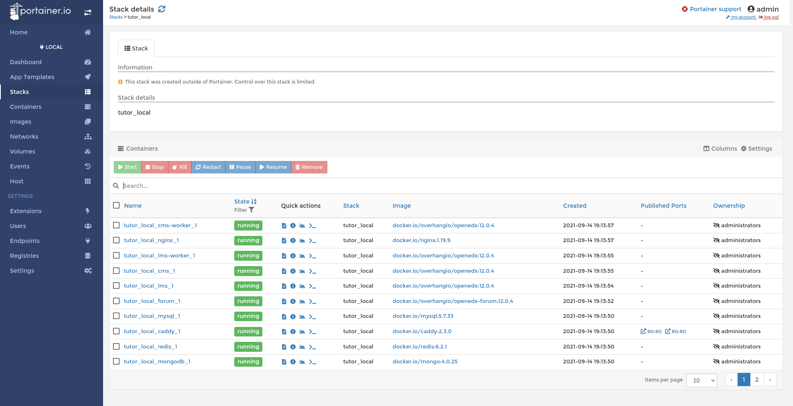

+++
date = '2026-05-29T10:00:00+09:00'
draft = false
title = '抛弃 Portainer 投入 Dockge 的怀抱：抽象层屏蔽掉的，才是最贵的部分'
seo_description = "把跑了三年的 Portainer 换成 Dockge 的完整记录：迁移思路、immutable tag 部署流程、三个隐藏问题（kodexplorer 空壳、stump SQLite 死锁、cgroup memory 缺失），以及顺手解决的 DLNA 双服务共存难题（Jellyfin 和 Emby 用 macvlan 各自一个 LAN IP）。"
tags = ["Docker", "Homelab", "树莓派", "最佳实践"]
categories = ["技术"]
nolastmod = true
cover = 'ChatGPT Image 20260530 02_57_09.jpg'
images = ['ChatGPT Image 20260530 02_57_09.jpg']
+++

## Portainer 确实有点过时了

我挺喜欢折腾 Raspberry Pi。有一台 4B 折腾了多年。

在去年显卡大涨价之前，我在网上买了 5 玩得非常开心，容器层跟 4B 一样使用了 Portainer。

Portainer 新手起步的时候挺好用的：有 UI、有按钮、stack 一键部署、改个 env 不用记 docker compose 命令。但用得越久越觉得有些小毛病在反复出现。

比如：

- 改一行 environment 变量，UI 要把整个 stack 重新部署一遍
- "Re-pull image" 有时有效，有时又不拉镜像了
- 感觉镜像没更新时，总是要 ssh 进去兜底
- 一个 stack 多个服务，只改了一个服务的代码，其他都要 recreate
- 镜像版本管理不太完善 （也跟我滥用 `:latest` tag 有关）

## 硬件背景

| 项目 | 配置 |
|---|---|
| 主机 | Raspberry Pi 5 Model B (8 GB RAM) |
| CPU | ARM Cortex-A76 4 核 @ 2.4 GHz, aarch64 |
| 系统盘 | WD Black SN770 NVMe 250 GB |
| 扩展盘 | WD Red 4 TB(USB 3.0) |
| OS | Debian 12 bookworm, 内核 6.6.31+rpt-rpi-2712 |
| 容器数 | 32 个常驻，分布在 17 个 Portainer stack |

## 开搞

我跟 Claude 讨论了一下，他指出 Portainer 的问题来源：

▎ Portainer 那套之所以别扭，一半是 UI 把 compose 语义包了一层 force-recreate 的壳，一半是 mutable tag 的缓存问题。

<figure>
  
  <figcaption>Portainer 的管理界面</figcaption>
</figure>

换工具能解决前者。他说我可以试试 Dockge。



先给判断：换 UI 层用 **Dockge**,

**痛点 1(compose/stack 管理陈旧）+ 痛点 3（无翻译）→ Dockge**

Louis Lam(Uptime Kuma 作者）做的，目前的最优解，正好命中你的取向：

- 文件化架构，每个 stack 就是标准的 compose.yaml + .env, 存在 /opt/stacks/, 设计原则就是"compose 文件应该能用标准 docker 命令管理，而不是锁进专有格式"。这意味着 Dockge 只是个 UI 视图，底层文件你随时可以 `cd /opt/stacks/xxx && docker compose ...` 直接操作——完全符合你 idempotent/reproducible 的要求，而且天然可以把整个目录扔进 git。
- 通过 vue-i18n 支持 31 种语言，社区用 Weblate 维护翻译，含简体中文。痛点 3 直接解决。
- 多平台镜像 amd64/arm64/armv7, 树莓派包含在内；v1.5 加了 multi-agent, 可以从一个界面管多台 Docker host; 接近 22000 stars。



那还说什么，直接开搞。

### 迁移前准备

先建好目录：

```bash
sudo mkdir -p /opt/dockge/data /opt/stacks
```

`/opt/stacks` 是 Dockge 的 stack 根目录，每个子目录就是一个 stack。

新建 `/opt/dockge/compose.yaml`：

```yaml
services:
  dockge:
    image: louislam/dockge:1
    container_name: dockge
    restart: unless-stopped
    ports:
      - 5001:5001
    volumes:
      - /var/run/docker.sock:/var/run/docker.sock
      - /opt/dockge/data:/app/data
      - /opt/stacks:/opt/stacks
    environment:
      DOCKGE_STACKS_DIR: /opt/stacks
```

这里有个容易踩的细节：`DOCKGE_STACKS_DIR` 在容器里的路径必须和 host 上的路径**完全相同**。Dockge 通过 docker.sock 调 host 上的 `docker compose`，compose 解析的是 host 绝对路径——所以宿主和容器看到的 `/opt/stacks` 必须是同一个字符串。

跑起来：

```bash
cd /opt/dockge && sudo docker compose up -d
```

打开 `http://192.168.0.110:5001` 创建管理员账号。

Dockge 启动后会扫两类东西：

- `/opt/stacks/` 下的子目录——每个识别为一个它管的 stack
- 通过 docker API 看到的、project name 不在 `/opt/stacks/` 里的运行中 stack——标成 "this stack is not managed by Dockge"

### 迁移思路

我让 Claude 分批进行，他完成一批，我验收一批。

迁移的 pattern 其实非常简单：

```bash
# 在 Pi 上对每个 stack
sudo mkdir -p /opt/stacks/<project>
sudo cp /var/lib/docker/volumes/portainer_data/_data/compose/<id>/docker-compose.yml \
/opt/stacks/<project>/compose.yaml
sudo cp /var/lib/docker/volumes/portainer_data/_data/compose/<id>/stack.env \
/opt/stacks/<project>/.env

# 旧位置 down
sudo docker compose -f /var/lib/.../compose/<id>/docker-compose.yml -p <project> down

# 新位置 up
cd /opt/stacks/<project> && sudo docker compose up -d

```

挑 3 个有代表性的讲讲。

- 第一个：private-registry

私有仓库容器，数据在 /opt/docker-registry bind mount。 作为第一个练练手。

第一个发现：Portainer UI 上点 "Remove stack" 是真的会跑 docker compose down, 你会发现正在跑的容器也被一起杀了。

- 第二个：photoview + mariadb

多容器，数据库。验证 Dockge 下 service-to-service DNS、depends_on healthcheck、bind mount 数据库都能保留。

photoview 的 compose 引用了一堆 env 变量 (${MARIADB_USER} 之类）,.env 文件得跟着搬。

第二个发现：Portainer 那边环境变量保存在 stack.env, Dockge 则保存在 .env, 直接 cp 改名就行。

- 第三个：ehstash（自己的服务）

5 个服务、4 个自建镜像、预期配置和真实配置已经 drift 了一段时间。

确定唯一配置后，切过去之后容器都自动起来，数据 bind mount 复用，连 db 也正常。

技术上证明：只要 project name 保持，你随便换 compose 的物理位置，docker 都不在意。

### immutable tag

接下来是真正想做的事：immutable tag。

我把 Makefile 加了 make release-sha, 核心几行就这样：

```sh
GIT_SHA := $(shell git rev-parse --short=12 HEAD)

release-sha: build
@for entry in api scraper frontend pi-sync; do \
    docker tag  $$entry:latest $(REGISTRY)/$$entry:latest && \
    docker tag  $$entry:latest $(REGISTRY)/$$entry:$(GIT_SHA) && \
    docker push $(REGISTRY)/$$entry:latest && \
    docker push $(REGISTRY)/$$entry:$(GIT_SHA); \
done
@echo "Released eh-stash @ $(GIT_SHA)"

```

简单粗暴，关键是 :$(GIT_SHA) 这个 immutable handle 永远不会被覆盖。

部署流程现在长这样：
1. 本地 make release-sha → 拿到当前 commit 的 12 位 SHA
2. 编辑 pi 上 /opt/stacks/ehstash/.env, 把 TAG= 这一行改成新 SHA
3. docker compose pull && docker compose up -d

## 检查配置的三个意外收获

这一节是这次迁移最魔幻的部分。

### 收获一：kodexplorer 跑了三周的空壳

kodexplorer 是我之前装的一个文件管理器。Portainer 里看它一直 "Up 3 weeks (healthy)", 我也没怎么用，以为它就是默默活着。

搬的时候发现他早就挂了：

>HTTP 403 forbidden

掉进去查：容器里 /var/www/html/ 是空的——本该有 index.php 和整套 PHP 源码，只剩两个 named volume mount(config/ 和 data/)。nginx 找不到 index, 所以
403。

读这镜像的 entrypoint.sh: 它有一个版本号对比逻辑——如果 /var/www/html/config/version.php（在 named volume 里）的版本号 不低于镜像里
/usr/src/kodexplorer/config/version.php, 就跳过初始化 (rsync 源码到 webroot)。

也就是说：可能是某次 Portainer 强制 down -v 把 webroot 这个匿名 volume 清掉了，但 config volume 留住了 version.php
"我已装好"的标记。从那时起 entrypoint 每次重启都跳过 init,webroot 永远是空的，而我一直以为它在跑。

修复：容器里手动 rsync 源码进去 + 在 compose.yaml 里把 /var/www/html 也加成 named volume（防止下次 down 再把它清掉）。

### 收获二：stump 的 SQLite 死锁

stump 是个漫画 / 电子书管理器。Portainer 里它显示 "Restarting (101) 23 seconds ago"——一直在重启。

看 log:

```sh
thread 'main' panicked at /app/core/src/context.rs:53:6:
Failed to connect to database: DBError(Exec(SqlxError(Database(
SqliteError { code: 1, message: "no such table: main.book_club_discussions" }
))))
```

schema migration 的问题。可能某一次拉了新版镜像，新代码期待一个新 schema,migration 系统跑挂了。从那以后每次启动直接 panic, 容器陷入永久 restarting。

修复方案是把 SQLite db 备份 + 删掉，让 stump 重新建库。：

```sh
sudo mv /opt/stump/stump.db /opt/stump/stump.db.bak.$(date +%s)
docker compose up -d
# HTTP 200 ✓
```

### 收获三：树莓派整机内存指标缺失

迁移完所有 stack 之后我觉得 Dockge 简洁是挺简洁，缺了监控层。

Claude 推荐我装 Beszel —— 一个比 Grafana 轻得多的容器监控，Pi homelab 友好。

装好启动 agent, 看 log 一片红：

```sh
ERROR Error getting container stats err="<container> - bad memory stats -
see https://github.com/henrygd/beszel/issues/144"

```

15+ 个容器全报这个。查 issue #144——树莓派 OS 默认 kernel cmdline 里没启用 cgroup memory accounting。

Docker 自己能跑（降级使用其他指标）, 但像 Beszel 这种细粒度抓内存的工具就读不到数据。

修复：

```sh
# /boot/firmware/cmdline.txt 行末追加（必须保持单行）
cgroup_memory=1 cgroup_enable=memory

# 重启 pi
sudo reboot

```

90 秒后 pi 回来，所有容器自动重启，Beszel 立刻能读到内存了。

<figure>
  
  <figcaption>Beszel 的监控界面</figcaption>
</figure>

跑了几年容器在树莓派上，根本不知道每个服务实际吃多少 RAM。如果不是因为 Beszel 主动报错，我都不知道树莓派本身是支持查容器内存的！

---

## 顺手：DLNA 双服务共存

整理服务的时候意识到，也许可以让 Claude 看看能不能做 DLNA 双服务共存。

现状 As-is：

- **Emby**（host 网络）—— 电视搜得到 ✅
- **Jellyfin**（bridge + `9096:8096` 端口映射）—— 电视搜不到 ❌

原本的限制是：Jellyfin 改不了 host 模式 ——和 Emby 撞 UDP 1900。

Claude 说真有解决方案：


### bridge 对 DLNA 在协议层就是错的

DLNA 跑两件事：SSDP 多播（UDP `239.255.255.250:1900`）做发现，HTTP 做内容。关键是多播——必须在**同一个 LAN 广播域**里才能收到。

Docker 默认 bridge：

```
[Jellyfin 172.17.0.5]──veth─[docker0]──NAT──[eth0 192.168.0.110]──[LAN]
```

两层不通：

1. 电视的 M-SEARCH 多播打到 eth0 后，**Docker 不会自动转发到 docker0**
2. 就算通了，Jellyfin 在 SSDP 包里写的"我的地址"是 `172.17.0.5`——电视没法路由到这个内网 IP

端口映射只解决 TCP，**多播协议层面就和 bridge 不兼容**。

### host 模式的死路

`network_mode: host` 等于把容器扔进宿主的网络命名空间。多播能进出 eth0，SSDP 包里写的就是 LAN 真实 IP——所以 Emby 一直工作。

但 host 模式下宿主**所有端口共享一个命名空间**：

- Emby 占了 `:1900` → OK
- Jellyfin 也想占 `:1900` → `bind: address already in use`

DLNA 协议规定 SSDP 必须在 1900 上做发现，不能改。**两个 DLNA 服务在 host 模式下不可能共存**。

### macvlan 才是正解

macvlan 是 Docker 内置驱动，**给容器一个独立的 MAC + 独立的 LAN IP，直接挂到物理网卡的 L2 上**。对 LAN 来说每个容器就是一台独立的设备：

```
[Emby     192.168.0.241]  ┐
[Jellyfin 192.168.0.242]  ├─── eth0 ─── 路由器 ─── 电视
[树莓派   192.168.0.110]  ┘
```



太美妙了。这样三个问题同时解决！

多播天然通、各自 IP 各自 listen 1900、SSDP 包写的就是 LAN 上能路由的地址。

```bash
# 网络一次性建好
docker network create -d macvlan \
  --subnet=192.168.0.0/24 \
  --gateway=192.168.0.1 \
  --ip-range=192.168.0.240/29 \
  -o parent=eth0 \
  lan
```

`.240-.247` 这段 IP **必须先从路由器 DHCP 池里排除**，否则会撞地址。

Jellyfin compose 改两处——删 `ports:`、加 `networks` + 固定 IP：

```yaml
services:
  jellyfin:
    # ...volumes / devices / env 保留
    networks:
      lan:
        ipv4_address: 192.168.0.242

networks:
  lan:
    external: true
```

Emby 同理，删 `network_mode: host`、加 macvlan + `.241`。

```yaml
services:
  emby:
    # ...volumes / devices / env 保留
    networks:
      lan:
        ipv4_address: 192.168.0.241

networks:
  lan:
    external: true
```

### 几个需要注意的

1. **宿主主机访问不到 macvlan 容器**——Linux 内核禁止本机 ARP 回环。浏览器、电视、手机从别的设备访问没影响，但树莓派自己访问 Emby 和 Jellyfin 会不通。
2. **WiFi 基本走不通**——macvlan 要求网卡接受多 MAC，无线芯片大多拒绝。有线没事。
3. **IP 写死在 compose 里**——要在路由器后台从 DHCP 池排除一段。
4. **Jellyfin 10.9+ DLNA 已经拆成插件**——需要提前去安装 DLNA 插件。

---

切完之后电视上 Emby 和 Jellyfin 都搜得到，互不打架。

所有"多播发现"协议（mDNS/Bonjour、WSDD、SSDP、Avahi）在 Docker 里都吃同样的亏。Macvlan 是唯一能让它们正常工作的网络模式。

## 收尾

现在长这样：

<figure>
  
  <figcaption>Dockge 的管理界面</figcaption>
</figure>

Portainer 就再也不见了。

总结一下收益（从大到小）：

- 重新梳理清楚了自己的容器 stack
- Dockge+Beszel 是好组合，监控整体非常轻量
- Dockge UI 跟实际的 compose 文件同等含义，所以可以让 Claude Code 直接操作文件
- Emby Jellyfin DLNA 双服务共存
- 做了 immutable tag, 部署可审计可回滚
- 顺手修好了几个异常的公共镜像服务

---
总结一下教训：

任何抽象层都有一个"我替你决定"的隐藏成本。你享受了便利的同时，把一部分知情权交了出去。

勇敢的人先享受世界。
